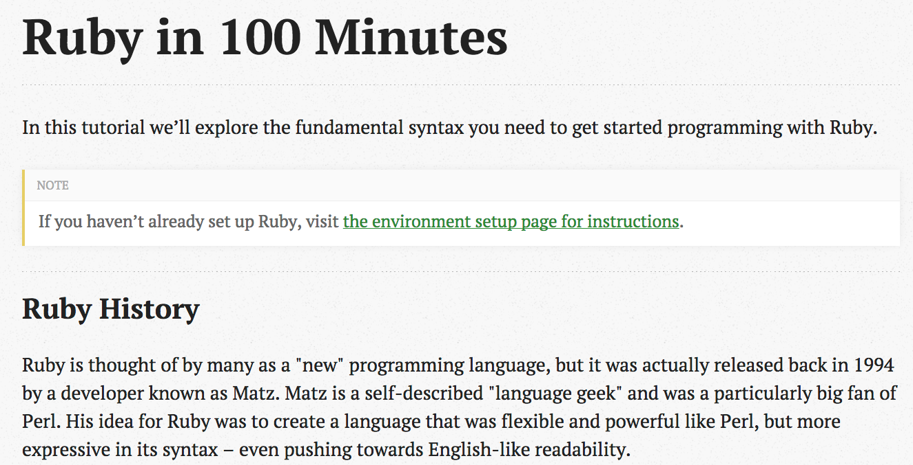

<!SLIDE>
# Building Talent the Old-fashioned Way

## Mike Subelsky
## [@subelsky](https://twitter.com/subelsky)
## <subelsky.com>

<!SLIDE transition=fade>

# There are smart, hard-working
# people in your city...

<!SLIDE>

# ...lacking traditional C.S. backgrounds...

<!SLIDE>

# ...who can excel in your company.

<!SLIDE>

# Background

<!SLIDE>

# 100s of Standalone Extractor Projects

<!SLIDE>

# Onshore vs. offshore?

<!SLIDE>

# Initial Blog Post

<!SLIDE>

# Google Docs Application

100+ applications from all over the world
Seemingly more diverse

<!SLIDE>

## 12 candidates selected

<!SLIDE>

## 4 two-hour evening sessions, recorded

## $20/hour

<!SLIDE>

[Ruby in 100 Minutes](http://tutorials.jumpstartlab.com/)

<!SLIDE>

## The Result!

<!SLIDE bullets incremental>

# Cultural Side-Effects

* Seeded our training culture (checklists)
* Promoted documentation-driven development
* Heavy TDD emphasis
* Streamlined dev environment setup
* Introduced new perspectives / backgrounds

<!SLIDE bullets incremental>

# What To Do Next Time

* Use professional trainers
* Use pre-configured cloud-based VMs
* Focus on language & framework vs. our tech
* Focus on open-source work

<!SLIDE bullets incremental>

# What To Do Next Time

* Assign individual mentors
* Provide admin support
* Separate version for mid-or-late career devs

<!SLIDE bullets incremental>

# How to get started

* Make your systems modular, habitable
* Identify maintenance tasks
* Apply "moneyball" techniques in hiring
* Start a beginner's meetup
* Start an intermediate-level meetup

<!SLIDE bullets incremental>

# How to get started

* Organize RailsGirls or equivalent event
* Don't send pizza to meetups; send trainers
* Partner with software training schools
* Big company: replicate [Hungry Academy](http://www.hungryacademy.com/)
* Small company: cooperate on a joint Hungry Academy
* Establish fellowships (a la [Fractured Atlas](http://www.fracturedatlas.org/site/blog/2014/03/12/new-summer-software-development-fellowship/))

<!SLIDE bullets incremental>

# Implications for Diversity in Tech

* 25-50% of programming is not writing code
* Not everyone learns programming the same way
* Mentorship, apprenticeship &hArr; more diverse candidate pool
* Education system can't/shouldn't solve this problem

<!SLIDE center>

# The Old-Fashioned Way...

## We used to do a good job at this

<!SLIDE>

# Don't bemoan the size of your local talent pool...

<!SLIDE>

# ..start growing it!

<!SLIDE>

# Reading List

* [The Blue Collar Coder](http://dashes.com/anil/2012/10/the-blue-collar-coder.html)
* [The Moneyball Approach to Building a Software Team](http://devblog.moz.com/2014/09/the-moneyball-approach-to-building-a-software-team/)
* [MFA in Software](https://www.dreamsongs.com/MFASoftware.html)
* [Germany's Apprentice Model](http://www.theatlantic.com/business/archive/2014/10/why-germany-is-so-much-better-at-training-its-workers/381550)
* [I Hate Puzzles: Am I Still A Programmer?](http://zef.me/3666/i-hate-puzzles/)
* [The Magic of Apprenticeship](http://fourhourworkweek.com/2012/11/12/the-magic-of-apprenticeship-a-how-to-guide/)

<!SLIDE>

# Reading List

* [apprentice.io](http://www.apprentice.io/)
* [Fractured Atlas Summer Fellowship](http://www.fracturedatlas.org/site/blog/2014/03/12/new-summer-software-development-fellowship/)
* [Ruby Apprentice Program](http://www.subelsky.com/2014/02/staqs-ruby-apprentice-program-was-great.html)
* [Stiffed](https://www.goodreads.com/book/show/200884.Stiffed)
* [Patterns of Software](http://www.goodreads.com/book/show/685486.Patterns_of_Software)

<!SLIDE>

# Questions?

## <mike@staq.com>
## <https://github.com/subelsky/building_talent>
## <https://tinyletter.com/subelsky>

*Built with [showoff](https://github.com/puppetlabs/showoff/) and [League Gothic](https://www.theleagueofmoveabletype.com/league-gothic)*
